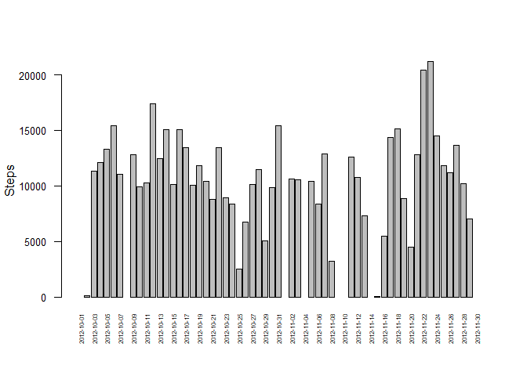
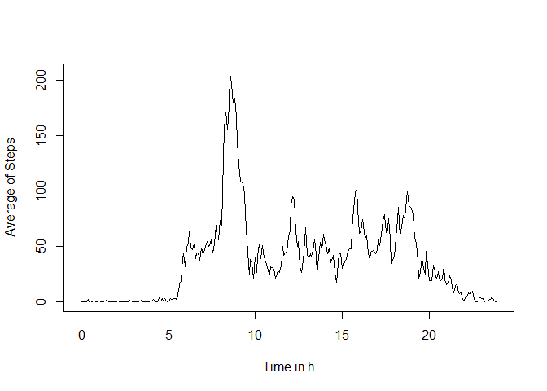
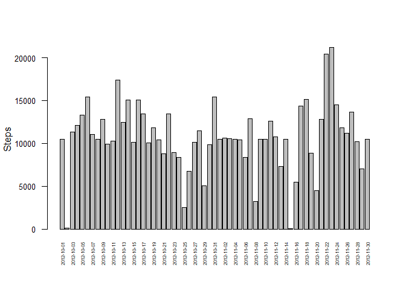
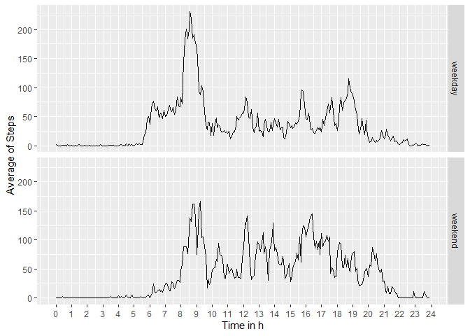

# Loading and preprocessing the data

First we load the required data from the input file "activity.csv". This file
must be placed in working directory. It can be downloaded as zip-file from
[here][1].


```r
activity <- read.csv("activity.csv")
```

We also consider the first entries in the data frame and structure of the data
frame


```r
head(activity)
```

```
##   steps       date interval
## 1    NA 2012-10-01        0
## 2    NA 2012-10-01        5
## 3    NA 2012-10-01       10
## 4    NA 2012-10-01       15
## 5    NA 2012-10-01       20
## 6    NA 2012-10-01       25
```


```r
str(activity)
```

```
## 'data.frame':	17568 obs. of  3 variables:
##  $ steps   : int  NA NA NA NA NA NA NA NA NA NA ...
##  $ date    : Factor w/ 61 levels "2012-10-01","2012-10-02",..: 1 1 1 1 1 1 1 1 1 1 ...
##  $ interval: int  0 5 10 15 20 25 30 35 40 45 ...
```

We see that while reading the input file, the date was interpreted as factor.
We convert it to date format.


```r
activity$date <- as.Date(as.character(activity$date), "%Y-%m-%d")
```

Let's again take a look on the structure


```r
str(activity)
```

```
## 'data.frame':	17568 obs. of  3 variables:
##  $ steps   : int  NA NA NA NA NA NA NA NA NA NA ...
##  $ date    : Date, format: "2012-10-01" "2012-10-01" ...
##  $ interval: int  0 5 10 15 20 25 30 35 40 45 ...
```

# What is mean total number of steps taken per day?

As first we calculate the total number of steps taken per day. For this we use
tapply function and make the resulting table a bit pretty for the next step


```r
StepsPerDay_vec <- as.data.frame(with(activity, tapply(steps, date, sum)))
StepsPerDay_tab <- cbind(rownames(StepsPerDay_vec), StepsPerDay_vec)
colnames(StepsPerDay_tab) <- c("date", "total.steps")
rownames(StepsPerDay_tab) <- c()
StepsPerDay_tab$date <- as.Date(StepsPerDay_tab$date, "%Y-%m-%d")
head(StepsPerDay_tab)
```

```
##         date total.steps
## 1 2012-10-01          NA
## 2 2012-10-02         126
## 3 2012-10-03       11352
## 4 2012-10-04       12116
## 5 2012-10-05       13294
## 6 2012-10-06       15420
```

Now we plot the histogram of total steps per day


```r
barplot(StepsPerDay_tab$total.steps, names.arg = StepsPerDay_tab$date,
        cex.names = 0.5, cex.axis = 0.8, las = 2, ylab = "Steps")
```

<!-- -->

As last step in this section, we calculate mean and median of the total number
of steps taken per day.

Mean:

```r
mean(StepsPerDay_tab$total.steps, na.rm = TRUE)
```

```
## [1] 10766.19
```

Median:

```r
median(StepsPerDay_tab$total.steps, na.rm = TRUE)
```

```
## [1] 10765
```

# What is the average daily activity pattern?

Here we would like to have a time series of the average number of steps taken
(averaged across all days) for every 5-minute interval. Again we start with
tapply function and make the resulting table a bit more pretty for the plot


```r
TimeSeries <- as.data.frame(with(activity, tapply(steps, interval,
                                                  mean, na.rm = TRUE)))
TimeSeries_tab <- cbind(rownames(TimeSeries), TimeSeries)
colnames(TimeSeries_tab) <- c("interval", "average.steps")
rownames(TimeSeries_tab) <- c()
head(TimeSeries_tab,15)
```

```
##    interval average.steps
## 1         0     1.7169811
## 2         5     0.3396226
## 3        10     0.1320755
## 4        15     0.1509434
## 5        20     0.0754717
## 6        25     2.0943396
## 7        30     0.5283019
## 8        35     0.8679245
## 9        40     0.0000000
## 10       45     1.4716981
## 11       50     0.3018868
## 12       55     0.1320755
## 13      100     0.3207547
## 14      105     0.6792453
## 15      110     0.1509434
```

Note that interval identifier is actually not minutes or time at all. The first
two digits, if present, mean hour. The last two digits mean minutes. We want to
translate this identifier into actual time. It can be tackled as follows


```r
library(chron) # function from this library is used to convert intervals to time
```

```
## Warning: package 'chron' was built under R version 3.6.1
```

```r
temp <- paste(floor(as.numeric(as.character(TimeSeries_tab$interval)) /
                                     100),
                       as.numeric(as.character(TimeSeries_tab$interval)) %% 100,
                       sep = ":")
TimeSeries_tab$time <- times(paste(temp, ":00"))
head(TimeSeries_tab,15)
```

```
##    interval average.steps     time
## 1         0     1.7169811 00:00:00
## 2         5     0.3396226 00:05:00
## 3        10     0.1320755 00:10:00
## 4        15     0.1509434 00:15:00
## 5        20     0.0754717 00:20:00
## 6        25     2.0943396 00:25:00
## 7        30     0.5283019 00:30:00
## 8        35     0.8679245 00:35:00
## 9        40     0.0000000 00:40:00
## 10       45     1.4716981 00:45:00
## 11       50     0.3018868 00:50:00
## 12       55     0.1320755 00:55:00
## 13      100     0.3207547 01:00:00
## 14      105     0.6792453 01:05:00
## 15      110     0.1509434 01:10:00
```

Now we plot this time series (Note: the TimeSeries_tab$time is of class time.
Somehow interpret plot function this class as a number between 0 and 1. Easy way
to deal with it to multiply with 24)


```r
with(TimeSeries_tab, plot(time * 24, average.steps, type = "l",
                          xlab = "Time in h", ylab = "Average of Steps"))
```

<!-- -->


Now we want to know the 5-minute interval, which, on average across all the days
in the dataset, contains the maximum number of step.

This interval has identifier:


```r
TimeSeries_tab[TimeSeries_tab$average.steps ==
                       max(TimeSeries_tab$average.steps), "interval"]
```

```
## [1] 835
## 288 Levels: 0 10 100 1000 1005 1010 1015 1020 1025 1030 1035 1040 ... 955
```

which corresponds to following time


```r
TimeSeries_tab[TimeSeries_tab$average.steps ==
                       max(TimeSeries_tab$average.steps), "time"]
```

```
## [1] 08:35:00
```

and is associated with following averaged number of steps 


```r
max(TimeSeries_tab$average.steps)
```

```
## [1] 206.1698
```

# Imputing missing values

First we consider the number of missing values in data set:


```r
sum(is.na(activity$steps))
```

```
## [1] 2304
```

Now we want to find a strategy to impute missing values. First we assume that
each subject is usualy sleeping between 10 pm and 6 am. So, for this times we
replace NAs by zero.


```r
activity_enhanced <- activity
activity_enhanced[(activity_enhanced$interval <= 600 |
                          activity_enhanced$interval > 2200) &
                          is.na(activity_enhanced$steps),]$steps <- 0
head(activity_enhanced)
```

```
##   steps       date interval
## 1     0 2012-10-01        0
## 2     0 2012-10-01        5
## 3     0 2012-10-01       10
## 4     0 2012-10-01       15
## 5     0 2012-10-01       20
## 6     0 2012-10-01       25
```

Now we have considerably lower number of NAs, but still a lot:


```r
sum(is.na(activity_enhanced$steps))
```

```
## [1] 1536
```

As next, we assume that each subject has a very regular daily routine, so
that we cann fill the rest of missing values with the mean for the corresponding
5-minute interval. For this purpose we can reuse our results from prevous
section.


```r
TimeSeries_tab$interval <- as.integer(as.character(TimeSeries_tab$interval))
for (i in 1:length(activity_enhanced$steps)){
        if(is.na(activity_enhanced$steps[i])){
                activity_enhanced$steps[i] <-
                        TimeSeries_tab[TimeSeries_tab$interval ==
                                               activity_enhanced$interval[i],]$
                        average.steps
                }
        }
sum(is.na(activity_enhanced$steps))
```

```
## [1] 0
```

Thus, our data table has no NAs yet. Till the end of this project we will work
with data frame "activity_enhanced".

Now we repeat the steps from section "What is mean total number of steps taken
per day?". But now we use the data frame "activity_enhanced" with missing data
filled in.

As first we calculate the total number of steps taken per day. For this we use
tapply function and make the resulting table a bit pretty for the next step


```r
StepsPerDay_vec1 <- as.data.frame(with(activity_enhanced,
                                      tapply(steps, date, sum)))
StepsPerDay_tab1 <- cbind(rownames(StepsPerDay_vec1), StepsPerDay_vec1)
colnames(StepsPerDay_tab1) <- c("date", "total.steps")
rownames(StepsPerDay_tab1) <- c()
StepsPerDay_tab1$date <- as.Date(StepsPerDay_tab1$date, "%Y-%m-%d")
head(StepsPerDay_tab1)
```

```
##         date total.steps
## 1 2012-10-01    10482.17
## 2 2012-10-02      126.00
## 3 2012-10-03    11352.00
## 4 2012-10-04    12116.00
## 5 2012-10-05    13294.00
## 6 2012-10-06    15420.00
```

Now we plot the histogram of total steps per day


```r
barplot(StepsPerDay_tab1$total.steps, names.arg = StepsPerDay_tab1$date,
        cex.names = 0.5, cex.axis = 0.8, las = 2, ylab = "Steps")
```

<!-- -->

As last step in this section, we calculate mean and median of the total number
of steps taken per day.

Mean:

```r
mean(StepsPerDay_tab1$total.steps, na.rm = TRUE)
```

```
## [1] 10728.94
```

Median:

```r
median(StepsPerDay_tab1$total.steps, na.rm = TRUE)
```

```
## [1] 10482.17
```

As one can see the values of median and mean have changed compared to
calculation without filling in missing data. Especially the difference between
mean and median has become much larger. Since we replaced missing values for
sleeping hours by 0, the overall mean and median have been decreased.

# Are there differences in activity patterns between weekdays and weekends?

Now, we introduce a new column in the data set which indicates whether the
considered date is weekday or weekend


```r
Weekday <- weekdays(activity_enhanced$date)
activity_enhanced$weekday.weekend <- as.factor(ifelse(Weekday %in%
                                                    c("Samstag", "Sonntag"),
                                            "weekend", "weekday"))
```

Now we create a plots similar to the plot in section "What is the average daily
activity pattern?" but once for weekdays and once for weekend


```r
library(tidyr)
TimeSeries1 <- as.data.frame(with(activity_enhanced,
                                  tapply(steps,list(interval, weekday.weekend),
                                                  mean)))
TimeSeries_tab1 <- cbind(rownames(TimeSeries1), TimeSeries1)
TimeSeries_tab1 <- gather(TimeSeries_tab1, key = "", value = "", 2:3)
rownames(TimeSeries_tab) <- c()
colnames(TimeSeries_tab1) <- c("interval", "part.of.the.week", "average.steps")
temp1 <- paste(floor(as.numeric(as.character(TimeSeries_tab1$interval)) /
                                     100),
                       as.numeric(as.character(TimeSeries_tab1$interval)) %% 100,
                       sep = ":")
TimeSeries_tab1$time <- times(paste(temp1, ":00"))
head(TimeSeries_tab1)
```

```
##   interval part.of.the.week average.steps     time
## 1        0          weekday    2.02222222 00:00:00
## 2        5          weekday    0.40000000 00:05:00
## 3       10          weekday    0.15555556 00:10:00
## 4       15          weekday    0.17777778 00:15:00
## 5       20          weekday    0.08888889 00:20:00
## 6       25          weekday    1.31111111 00:25:00
```

And finally we create the requested plot


```r
library(ggplot2)
ggplot(TimeSeries_tab1, aes(x = time * 24, y = average.steps)) + geom_line() +
        facet_grid(part.of.the.week~.) + xlab("Time in h") +
        ylab("Average of Steps") + scale_x_continuous(breaks = seq(0, 24, 1))
```

<!-- -->


[1]: https://d396qusza40orc.cloudfront.net/repdata%2Fdata%2Factivity.zip
