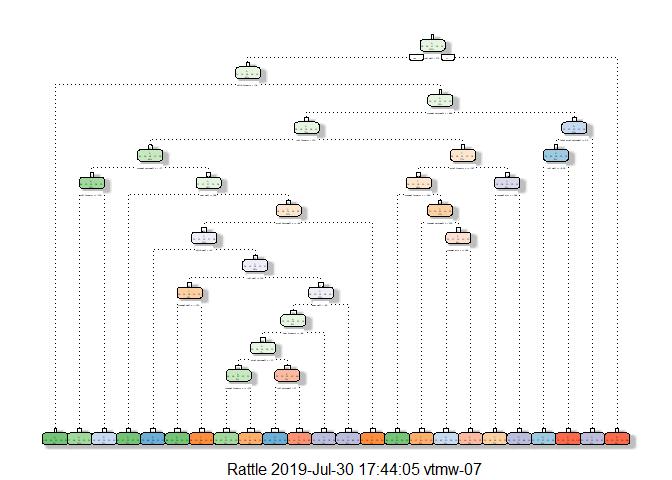

# Synposis

We investigate data from [here][1]. There is a training data set and a testing set. We train our models to predict the variable "classe" (present in training and absent in testing data set). As models, we use SVM, Decision trees and random forest. We also consider an ensemble of all three models.

# Data Preparation

First we load training and testing data from working directory and consider the
structure of the training data


The training set consists of 19622 observations with 160 variables (s. Appendix, table in sub-section "Structure Table for Training Data"). We do not need all of
them. Since they do not discribe a particular movement, we drop variables "X",
"user-name", "raw_timestamp_part_1", "raw_timestamp_part_2 ", "cvtd_timestamp",
"new_window" and "num_window". We treat all other variables except of "classe" 
as numeric. We do the same for testing set (test has no variable "classe" but
variable "problem_id).


It is noticeable that a lot of variables in training and testing sets do not 
include any values (all values of a variable are NAs). We also drop those variables which are NA in
testing data set (applied to both data sets). We stay with 52 predictors and 1
responce variable. All predictors do not include any NAs values.


# Data spliting

Since we have a lot of observations in training data set, we can split it into actual training
part (70%) and cross-testing part (30%) (seed was set to 2019)


# Data Scaling

Since one of the models we use is SVM, we should scale our data. We perform standard normalization using mean and standard deviation. To determine these parameters, actual training set is used. These parameters are also applied to cross-testing and testing data. For decision trees and random forest, we omit scaling.


# Models

## SVM

Now, we train SVM model. Note that we have already performed scaling of data befor.


```
##  Accuracy 
## 0.9564679
```

```
##  Accuracy 
## 0.9456245
```

The accuracy of SVM model on actual training set is 95.65% and on cross-testing set 94.56%!

## Decision Trees

Now, we consider decision trees (default settings)

<!-- -->

```
##  Accuracy 
## 0.7571522
```

```
##  Accuracy 
## 0.7524214
```

The accuracy of decision trees model on actual training set is 75.72% and on cross-testing set 75.24%!

## Random Forest

Now, we consider random forest (default settings)


```
## Accuracy 
##        1
```

```
## Accuracy 
## 0.995582
```

The accuracy of random forest model on actual training set is 100% and on cross-testing set 99.56%!

## Ensemble model

Now, we consider an ensemble consisting of our previous SVM, decision tree and random forest models. We combine them using random forest since it seems to perform very weel


```
## Accuracy 
##        1
```

```
##  Accuracy 
## 0.9954121
```
The accuracy of random forest model on actual training set is 100% and on cross-testing set 99.54%!

## Final testing

We see that SVM, random forest and our ensamble are performing amazingly well. Since random forest provides best accuracy on cross-testing set. We apply it to our final testing set which is not labeld with "classe".


```
##  1  2  3  4  5  6  7  8  9 10 11 12 13 14 15 16 17 18 19 20 
##  B  A  B  A  A  E  D  B  A  A  B  C  B  A  E  E  A  B  B  B 
## Levels: A B C D E
```

## Conclusion

On considered data set, random forest performs better than SVM, decision trees and even ensemble. SVM performs also very well.

# References


[1]:http://groupware.les.inf.puc-rio.br/har

# Appendix

## Structure Table for Training Data


```
## 'data.frame':	19622 obs. of  160 variables:
##  $ X                       : int  1 2 3 4 5 6 7 8 9 10 ...
##  $ user_name               : chr  "carlitos" "carlitos" "carlitos" "carlitos" ...
##  $ raw_timestamp_part_1    : int  1323084231 1323084231 1323084231 1323084232 1323084232 1323084232 1323084232 1323084232 1323084232 1323084232 ...
##  $ raw_timestamp_part_2    : int  788290 808298 820366 120339 196328 304277 368296 440390 484323 484434 ...
##  $ cvtd_timestamp          : chr  "05/12/2011 11:23" "05/12/2011 11:23" "05/12/2011 11:23" "05/12/2011 11:23" ...
##  $ new_window              : chr  "no" "no" "no" "no" ...
##  $ num_window              : int  11 11 11 12 12 12 12 12 12 12 ...
##  $ roll_belt               : num  1.41 1.41 1.42 1.48 1.48 1.45 1.42 1.42 1.43 1.45 ...
##  $ pitch_belt              : num  8.07 8.07 8.07 8.05 8.07 8.06 8.09 8.13 8.16 8.17 ...
##  $ yaw_belt                : num  -94.4 -94.4 -94.4 -94.4 -94.4 -94.4 -94.4 -94.4 -94.4 -94.4 ...
##  $ total_accel_belt        : int  3 3 3 3 3 3 3 3 3 3 ...
##  $ kurtosis_roll_belt      : chr  "" "" "" "" ...
##  $ kurtosis_picth_belt     : chr  "" "" "" "" ...
##  $ kurtosis_yaw_belt       : chr  "" "" "" "" ...
##  $ skewness_roll_belt      : chr  "" "" "" "" ...
##  $ skewness_roll_belt.1    : chr  "" "" "" "" ...
##  $ skewness_yaw_belt       : chr  "" "" "" "" ...
##  $ max_roll_belt           : num  NA NA NA NA NA NA NA NA NA NA ...
##  $ max_picth_belt          : int  NA NA NA NA NA NA NA NA NA NA ...
##  $ max_yaw_belt            : chr  "" "" "" "" ...
##  $ min_roll_belt           : num  NA NA NA NA NA NA NA NA NA NA ...
##  $ min_pitch_belt          : int  NA NA NA NA NA NA NA NA NA NA ...
##  $ min_yaw_belt            : chr  "" "" "" "" ...
##  $ amplitude_roll_belt     : num  NA NA NA NA NA NA NA NA NA NA ...
##  $ amplitude_pitch_belt    : int  NA NA NA NA NA NA NA NA NA NA ...
##  $ amplitude_yaw_belt      : chr  "" "" "" "" ...
##  $ var_total_accel_belt    : num  NA NA NA NA NA NA NA NA NA NA ...
##  $ avg_roll_belt           : num  NA NA NA NA NA NA NA NA NA NA ...
##  $ stddev_roll_belt        : num  NA NA NA NA NA NA NA NA NA NA ...
##  $ var_roll_belt           : num  NA NA NA NA NA NA NA NA NA NA ...
##  $ avg_pitch_belt          : num  NA NA NA NA NA NA NA NA NA NA ...
##  $ stddev_pitch_belt       : num  NA NA NA NA NA NA NA NA NA NA ...
##  $ var_pitch_belt          : num  NA NA NA NA NA NA NA NA NA NA ...
##  $ avg_yaw_belt            : num  NA NA NA NA NA NA NA NA NA NA ...
##  $ stddev_yaw_belt         : num  NA NA NA NA NA NA NA NA NA NA ...
##  $ var_yaw_belt            : num  NA NA NA NA NA NA NA NA NA NA ...
##  $ gyros_belt_x            : num  0 0.02 0 0.02 0.02 0.02 0.02 0.02 0.02 0.03 ...
##  $ gyros_belt_y            : num  0 0 0 0 0.02 0 0 0 0 0 ...
##  $ gyros_belt_z            : num  -0.02 -0.02 -0.02 -0.03 -0.02 -0.02 -0.02 -0.02 -0.02 0 ...
##  $ accel_belt_x            : int  -21 -22 -20 -22 -21 -21 -22 -22 -20 -21 ...
##  $ accel_belt_y            : int  4 4 5 3 2 4 3 4 2 4 ...
##  $ accel_belt_z            : int  22 22 23 21 24 21 21 21 24 22 ...
##  $ magnet_belt_x           : int  -3 -7 -2 -6 -6 0 -4 -2 1 -3 ...
##  $ magnet_belt_y           : int  599 608 600 604 600 603 599 603 602 609 ...
##  $ magnet_belt_z           : int  -313 -311 -305 -310 -302 -312 -311 -313 -312 -308 ...
##  $ roll_arm                : num  -128 -128 -128 -128 -128 -128 -128 -128 -128 -128 ...
##  $ pitch_arm               : num  22.5 22.5 22.5 22.1 22.1 22 21.9 21.8 21.7 21.6 ...
##  $ yaw_arm                 : num  -161 -161 -161 -161 -161 -161 -161 -161 -161 -161 ...
##  $ total_accel_arm         : int  34 34 34 34 34 34 34 34 34 34 ...
##  $ var_accel_arm           : num  NA NA NA NA NA NA NA NA NA NA ...
##  $ avg_roll_arm            : num  NA NA NA NA NA NA NA NA NA NA ...
##  $ stddev_roll_arm         : num  NA NA NA NA NA NA NA NA NA NA ...
##  $ var_roll_arm            : num  NA NA NA NA NA NA NA NA NA NA ...
##  $ avg_pitch_arm           : num  NA NA NA NA NA NA NA NA NA NA ...
##  $ stddev_pitch_arm        : num  NA NA NA NA NA NA NA NA NA NA ...
##  $ var_pitch_arm           : num  NA NA NA NA NA NA NA NA NA NA ...
##  $ avg_yaw_arm             : num  NA NA NA NA NA NA NA NA NA NA ...
##  $ stddev_yaw_arm          : num  NA NA NA NA NA NA NA NA NA NA ...
##  $ var_yaw_arm             : num  NA NA NA NA NA NA NA NA NA NA ...
##  $ gyros_arm_x             : num  0 0.02 0.02 0.02 0 0.02 0 0.02 0.02 0.02 ...
##  $ gyros_arm_y             : num  0 -0.02 -0.02 -0.03 -0.03 -0.03 -0.03 -0.02 -0.03 -0.03 ...
##  $ gyros_arm_z             : num  -0.02 -0.02 -0.02 0.02 0 0 0 0 -0.02 -0.02 ...
##  $ accel_arm_x             : int  -288 -290 -289 -289 -289 -289 -289 -289 -288 -288 ...
##  $ accel_arm_y             : int  109 110 110 111 111 111 111 111 109 110 ...
##  $ accel_arm_z             : int  -123 -125 -126 -123 -123 -122 -125 -124 -122 -124 ...
##  $ magnet_arm_x            : int  -368 -369 -368 -372 -374 -369 -373 -372 -369 -376 ...
##  $ magnet_arm_y            : int  337 337 344 344 337 342 336 338 341 334 ...
##  $ magnet_arm_z            : int  516 513 513 512 506 513 509 510 518 516 ...
##  $ kurtosis_roll_arm       : chr  "" "" "" "" ...
##  $ kurtosis_picth_arm      : chr  "" "" "" "" ...
##  $ kurtosis_yaw_arm        : chr  "" "" "" "" ...
##  $ skewness_roll_arm       : chr  "" "" "" "" ...
##  $ skewness_pitch_arm      : chr  "" "" "" "" ...
##  $ skewness_yaw_arm        : chr  "" "" "" "" ...
##  $ max_roll_arm            : num  NA NA NA NA NA NA NA NA NA NA ...
##  $ max_picth_arm           : num  NA NA NA NA NA NA NA NA NA NA ...
##  $ max_yaw_arm             : int  NA NA NA NA NA NA NA NA NA NA ...
##  $ min_roll_arm            : num  NA NA NA NA NA NA NA NA NA NA ...
##  $ min_pitch_arm           : num  NA NA NA NA NA NA NA NA NA NA ...
##  $ min_yaw_arm             : int  NA NA NA NA NA NA NA NA NA NA ...
##  $ amplitude_roll_arm      : num  NA NA NA NA NA NA NA NA NA NA ...
##  $ amplitude_pitch_arm     : num  NA NA NA NA NA NA NA NA NA NA ...
##  $ amplitude_yaw_arm       : int  NA NA NA NA NA NA NA NA NA NA ...
##  $ roll_dumbbell           : num  13.1 13.1 12.9 13.4 13.4 ...
##  $ pitch_dumbbell          : num  -70.5 -70.6 -70.3 -70.4 -70.4 ...
##  $ yaw_dumbbell            : num  -84.9 -84.7 -85.1 -84.9 -84.9 ...
##  $ kurtosis_roll_dumbbell  : chr  "" "" "" "" ...
##  $ kurtosis_picth_dumbbell : chr  "" "" "" "" ...
##  $ kurtosis_yaw_dumbbell   : chr  "" "" "" "" ...
##  $ skewness_roll_dumbbell  : chr  "" "" "" "" ...
##  $ skewness_pitch_dumbbell : chr  "" "" "" "" ...
##  $ skewness_yaw_dumbbell   : chr  "" "" "" "" ...
##  $ max_roll_dumbbell       : num  NA NA NA NA NA NA NA NA NA NA ...
##  $ max_picth_dumbbell      : num  NA NA NA NA NA NA NA NA NA NA ...
##  $ max_yaw_dumbbell        : chr  "" "" "" "" ...
##  $ min_roll_dumbbell       : num  NA NA NA NA NA NA NA NA NA NA ...
##  $ min_pitch_dumbbell      : num  NA NA NA NA NA NA NA NA NA NA ...
##  $ min_yaw_dumbbell        : chr  "" "" "" "" ...
##  $ amplitude_roll_dumbbell : num  NA NA NA NA NA NA NA NA NA NA ...
##   [list output truncated]
```

## Code


```r
# Used libraries
library(ggplot2)
library(caret)
library(rpart)
library(e1071)
library(rattle)
library(randomForest)
library(mgcv)
# Load data
input_training <- read.csv("pml-training.csv", stringsAsFactors = FALSE)
input_testing <- read.csv("pml-testing.csv", stringsAsFactors = FALSE)
# Delete variables which will not be used
training <- cbind(as.data.frame(lapply(input_training[, 8:159], as.numeric)),
                  classe = input_training$classe)
testing <- cbind(as.data.frame(lapply(input_testing[, 8:159], as.numeric)),
                  problem_id = input_testing$problem_id)
# Consider only variables which are present (not NA) in testing data set
training <- training[, colSums(is.na(testing)) != nrow(testing)]
testing <- testing[, colSums(is.na(testing)) != nrow(testing)]
# Split training data into true training part and cross-testing part
set.seed(2019)
inTrain <- createDataPartition(training$classe, p = 0.7, list = FALSE)
Ttraining <- training[inTrain, ]
Ttesting <- training[-inTrain, ]
# Parameters for normalization
means <- as.data.frame(lapply(Ttraining[, 1:52], mean))
sds <- as.data.frame(lapply(Ttraining[, 1:52], sd))
Ttraining_norm <- cbind(as.data.frame(scale(Ttraining[,1:52], center = means,
                                            scale = sds)),
                        classe = Ttraining$classe)
Ttesting_norm <- cbind(as.data.frame(scale(Ttesting[,1:52], center = means,
                                           scale = sds)),
                        classe = Ttesting$classe)
testing_norm <- cbind(as.data.frame(scale(testing[,1:52], center = means,
                                          scale = sds)),
                        problem_id = testing$problem_id)
SVM_model <- svm(classe ~ ., data = Ttraining_norm, scale = FALSE)
SVM_pred_Ttraining <- predict(SVM_model, Ttraining_norm)
acc_SVM_Ttraining <- confusionMatrix(SVM_pred_Ttraining, Ttraining_norm$classe)
SVM_pred_Ttesting <- predict(SVM_model, Ttesting_norm)
acc_SVM_Ttesting <- confusionMatrix(SVM_pred_Ttesting, Ttesting_norm$classe)
acc_SVM_Ttraining$overall[1]
acc_SVM_Ttesting$overall[1]
tree_model <- rpart(classe ~ ., data = Ttraining, method = "class")
fancyRpartPlot(tree_model)
tree_pred_Ttraining <- predict(tree_model, Ttraining, type = "class")
acc_tree_Ttraining <- confusionMatrix(tree_pred_Ttraining,
                                      Ttraining$classe)
tree_pred_Ttesting <- predict(tree_model, Ttesting, type = "class")
acc_tree_Ttesting <- confusionMatrix(tree_pred_Ttesting, Ttesting$classe)
acc_tree_Ttraining$overall[1]
acc_tree_Ttesting$overall[1]
rf_model <- randomForest(classe ~ ., data = Ttraining)
rf_pred_Ttraining <- predict(rf_model, Ttraining)
acc_rf_Ttraining <- confusionMatrix(rf_pred_Ttraining,
                                      Ttraining$classe)
rf_pred_Ttesting <- predict(rf_model, Ttesting)
acc_rf_Ttesting <- confusionMatrix(rf_pred_Ttesting, Ttesting$classe)
acc_rf_Ttraining$overall[1]
acc_rf_Ttesting$overall[1]
newdata_Ttraining = data.frame(classe = Ttraining$classe,
                               SVM = SVM_pred_Ttraining,
                               tree = tree_pred_Ttraining,
                               rf = rf_pred_Ttraining)
ens_model <- randomForest(classe ~ ., data = newdata_Ttraining)
ens_pred_Ttraining <- predict(ens_model, newdata_Ttraining)
acc_ens_Ttraining <- confusionMatrix(ens_pred_Ttraining,
                                      newdata_Ttraining$classe)
newdata_Ttesting = data.frame(classe = Ttesting$classe,
                              SVM = SVM_pred_Ttesting,
                              tree = tree_pred_Ttesting,
                              rf = rf_pred_Ttesting)
ens_pred_Ttesting <- predict(ens_model, newdata_Ttesting)
acc_ens_Ttesting <- confusionMatrix(ens_pred_Ttesting, newdata_Ttesting$classe)
acc_ens_Ttraining$overall[1]
acc_ens_Ttesting$overall[1]
rf_pred_testing <- predict(rf_model, testing)
rf_pred_testing
# Structure of training set
str(input_training)
```
